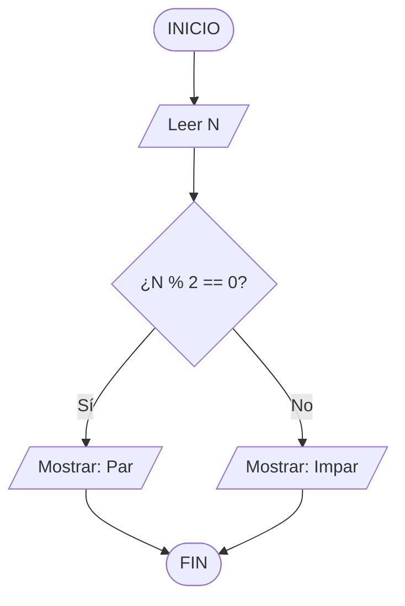

# 🛠️ Herramientas de Diagramación

Elige la herramienta que mejor se adapte a tu flujo de trabajo. Todas permiten crear diagramas de flujo.

---

## 🌐 Herramientas Online (sin instalación)

### 1. draw.io / diagrams.net ⭐ (Recomendada)
- **URL:** [https://draw.io](https://draw.io)
- **Precio:** Gratis
- **Ventajas:** Sin cuenta, exporta PNG/SVG/PDF, integración con GitHub y Google Drive, tiene todos los símbolos de diagrama de flujo

### 2. Lucidchart
- **URL:** [https://lucidchart.com](https://lucidchart.com)
- **Precio:** Gratis (con limitaciones) / $8 USD/mes
- **Ventajas:** Interfaz pulida, colaboración en tiempo real, excelentes plantillas

### 3. Whimsical
- **URL:** [https://whimsical.com](https://whimsical.com)
- **Precio:** Gratis (hasta 4 documentos)
- **Ventajas:** Rapidísimo, atajos de teclado eficientes, interfaz minimalista

### 4. Excalidraw
- **URL:** [https://excalidraw.com](https://excalidraw.com)
- **Precio:** Gratis y open-source
- **Ventajas:** Estilo "dibujado a mano", sin cuenta, colaboración con URL compartida

### 5. Miro
- **URL:** [https://miro.com](https://miro.com)
- **Precio:** Gratis (con limitaciones)
- **Ventajas:** Ideal para trabajo colaborativo, pizarra infinita

---

## 💻 Aplicaciones de Escritorio

### 6. Flowgorithm ⭐ (Especial para programación)
- **URL:** [http://flowgorithm.org](http://flowgorithm.org)
- **Precio:** Gratis
- **Por qué es especial:**
  - Diseñado específicamente para diagramas de flujo de programación
  - **¡Ejecuta tu diagrama!** → corre el algoritmo sin escribir código
  - **¡Genera código!** → traduce el diagrama a Python, Java, C#, Ruby, y más
  - Perfecta para la metodología de este repositorio

---

## 📝 Diagramas en Texto (Mermaid)

Puedes escribir diagramas directamente en Markdown que GitHub renderiza:

````markdown

````

**Editores con soporte Mermaid:** GitHub, VS Code (extensión), Notion, Obsidian

---

## 📋 Símbolos Estándar

| Nombre | Forma | Uso |
|--------|-------|-----|
| Terminal | Óvalo | INICIO y FIN |
| Proceso | Rectángulo | Cálculos, asignaciones |
| Decisión | Rombo ◇ | Condiciones (Sí/No) |
| Entrada/Salida | Paralelogramo ▱ | Leer o mostrar datos |
| Conector | Círculo ○ | Unir partes del diagrama |
| Flecha | → | Dirección del flujo |
| Subproceso | Rectángulo con bordes dobles | Llamada a función |

---

## 🎯 Recomendación por Situación

| Situación | Herramienta Recomendada |
|-----------|------------------------|
| Estás empezando | **Flowgorithm** — ejecuta el diagrama directamente |
| Quieres algo rápido online | **draw.io** o **Excalidraw** |
| Trabajo en equipo | **Miro** o **Lucidchart** |
| Quieres que quede en el repo | **Mermaid** en Markdown |
| En papel 📄 | ¡Un lápiz y cuaderno siempre funciona! |
