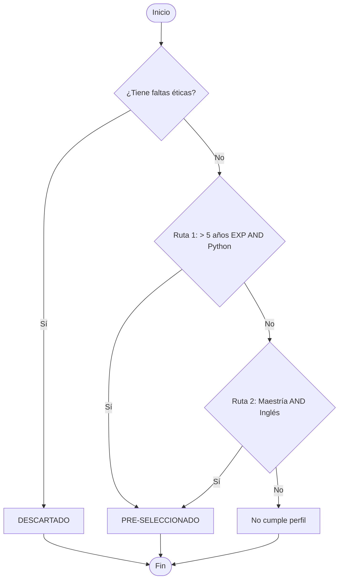

```mermaid
graph TD
    A([Inicio]) --> B{¿Tiene faltas éticas?}
    B -- Sí --> C[DESCARTADO]
    B -- No --> D{Ruta 1: > 5 años EXP AND Python}
    D -- Sí --> E[PRE-SELECCIONADO]
    D -- No --> F{Ruta 2: Maestría AND Inglés}
    F -- Sí --> E
    F -- No --> G[No cumple perfil]
    C --> H([Fin])
    E --> H
    G --> H
```
