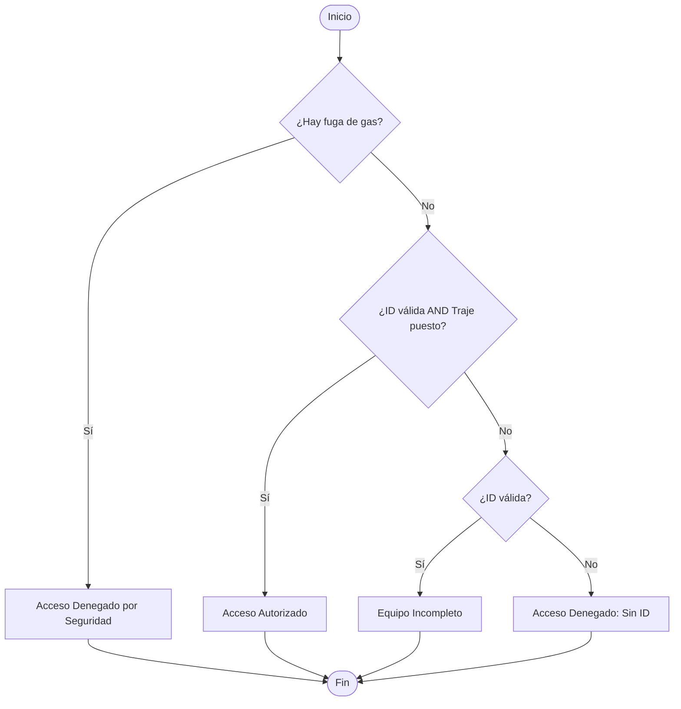

```mermaid
graph TD
    A([Inicio]) --> B{¿Hay fuga de gas?}
    B -- Sí --> C[Acceso Denegado por Seguridad]
    B -- No --> D{¿ID válida AND Traje puesto?}
    D -- Sí --> E[Acceso Autorizado]
    D -- No --> F{¿ID válida?}
    F -- Sí --> G[Equipo Incompleto]
    F -- No --> H[Acceso Denegado: Sin ID]
    C --> I([Fin])
    E --> I
    G --> I
    H --> I
```
