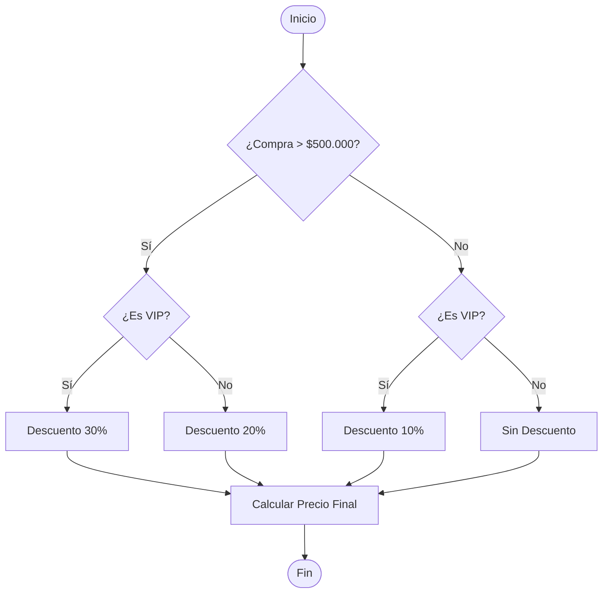

```mermaid
graph TD
    A([Inicio]) --> B{¿Compra > $500.000?}
    B -- Sí --> C{¿Es VIP?}
    C -- Sí --> D[Descuento 30%]
    C -- No --> E[Descuento 20%]
    B -- No --> F{¿Es VIP?}
    F -- Sí --> G[Descuento 10%]
    F -- No --> H[Sin Descuento]
    D --> I[Calcular Precio Final]
    E --> I
    G --> I
    H --> I
    I --> J([Fin])
```