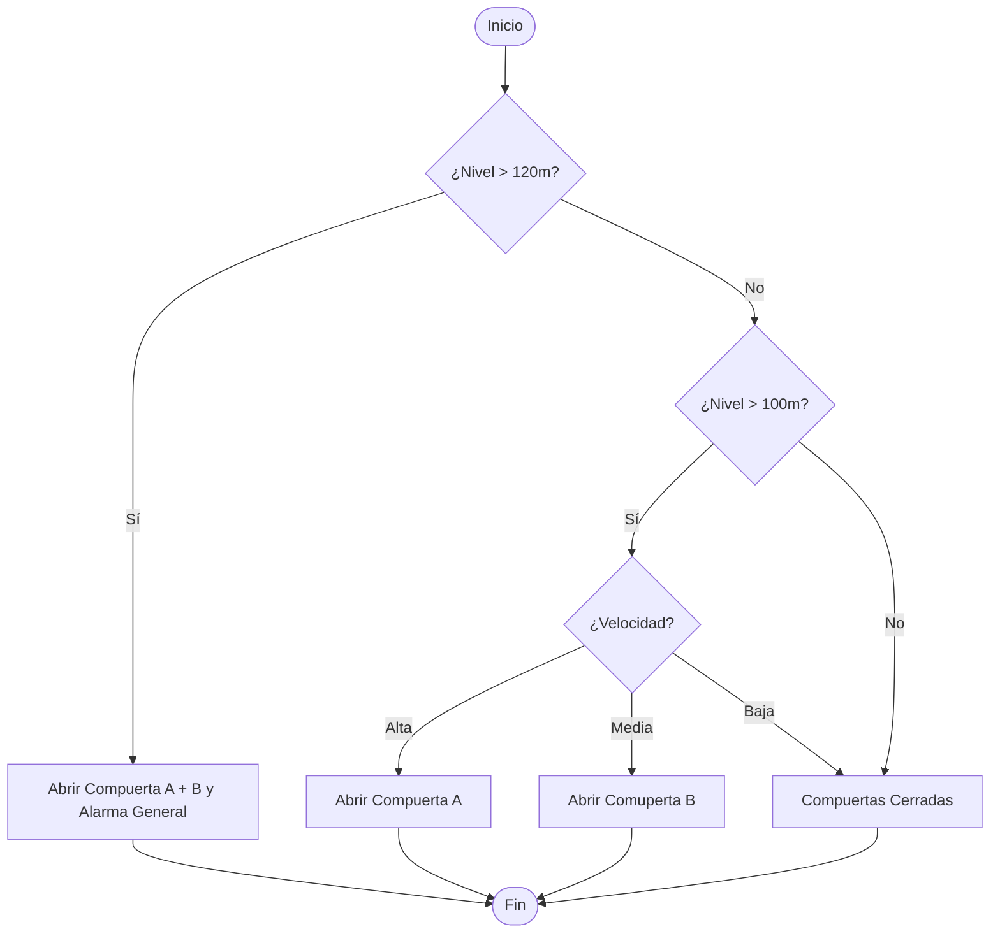

```mermaid
graph TD
    A([Inicio]) --> B{¿Nivel > 120m?}
    B -- Sí --> C[Abrir Compuerta A + B y Alarma General]
    B -- No --> D{¿Nivel > 100m?}
    D -- Sí --> E{¿Velocidad?}
    E -- Alta --> F[Abrir Compuerta A]
    E -- Media --> G[Abrir Comuperta B]
    E -- Baja --> H[Compuertas Cerradas]
    D -- No --> H
    C --> I([Fin])
    F --> I
    G --> I
    H --> I
```