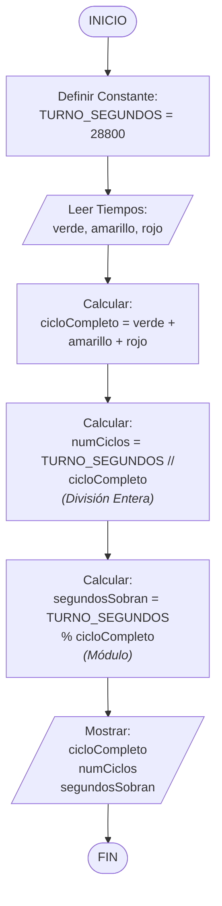

```mermaid
graph TD
    A([INICIO]) --> B
    B["Definir Constante:<br/>TURNO_SEGUNDOS = 28800"] --> C
    C[/"Leer Tiempos:<br/>verde, amarillo, rojo"/] --> D
    D["Calcular:<br/>cicloCompleto = verde +<br/>amarillo + rojo"] --> E
    E["Calcular:<br/>numCiclos = TURNO_SEGUNDOS //<br/>cicloCompleto<br/><i>(División Entera)</i>"] --> F
    F["Calcular:<br/>segundosSobran = TURNO_SEGUNDOS<br/>% cicloCompleto<br/><i>(Módulo)</i>"] --> G
    G[/"Mostrar:<br/>cicloCompleto<br/>numCiclos<br/>segundosSobran"/] --> H
    H([FIN])
```