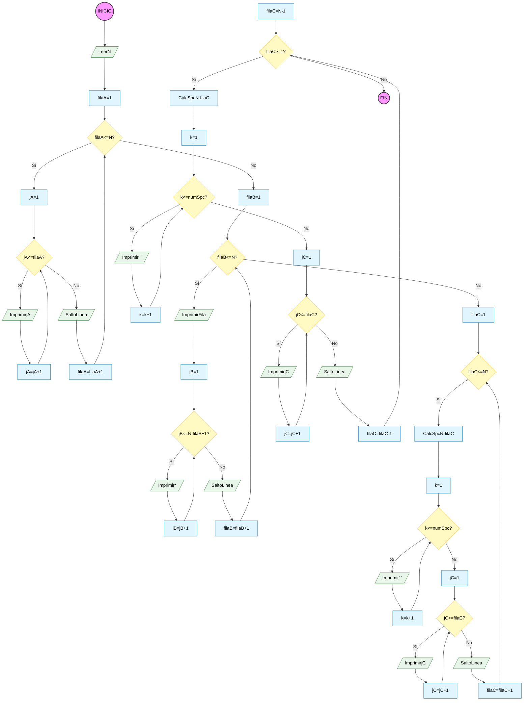

```mermaid
graph TD
    %% ==========================================
    %% --- 1. DEFINICIÓN DE ESTRUCTURA LÓGICA (NODOS Y CONEXIONES) ---
    %% ==========================================

    %% --- 1. INICIO Y LECTURA DE N ---
    Start((INICIO))
    ReadN[/"LeerN"/]
    InitA[filaA=1]

    Start --> ReadN
    ReadN --> InitA

    %% ==========================================
    %% --- 2. LOGICA PATRON A ---
    %% ==========================================
    ForA_Row{"filaA<=N?"}
    InitA_Col[jA=1]
    ForA_Col{"jA<=filaA?"}
    PrintA[/"ImprimirjA"/]
    IncrA_Col[jA=jA+1]
    NewLineA[/SaltoLinea/]
    IncrA_Row[filaA=filaA+1]

    InitA --> ForA_Row
    ForA_Row -- Sí --> InitA_Col
    InitA_Col --> ForA_Col
    ForA_Col -- Sí --> PrintA
    PrintA --> IncrA_Col
    IncrA_Col --> ForA_Col
    ForA_Col -- No --> NewLineA
    NewLineA --> IncrA_Row
    IncrA_Row --> ForA_Row

    %% ==========================================
    %% --- 3. LOGICA PATRON B ---
    %% ==========================================
    InitB[filaB=1]
    ForB_Row{"filaB<=N?"}
    PrintB_Row[/"ImprimirFila"/]
    InitB_Col[jB=1]
    
    %% Condición simplificada: N - filaB + 1
    ForB_Col{"jB<=N-filaB+1?"}
    PrintB_Star[/"Imprimir* "/]
    IncrB_Col[jB=jB+1]
    NewLineB[/SaltoLinea/]
    IncrB_Row[filaB=filaB+1]

    ForA_Row -- No --> InitB
    InitB --> ForB_Row
    ForB_Row -- Sí --> PrintB_Row
    PrintB_Row --> InitB_Col
    InitB_Col --> ForB_Col
    ForB_Col -- Sí --> PrintB_Star
    PrintB_Star --> IncrB_Col
    IncrB_Col --> ForB_Col
    ForB_Col -- No --> NewLineB
    NewLineB --> IncrB_Row
    IncrB_Row --> ForB_Row

    %% ==========================================
    %% --- 4. LOGICA PATRON C (Diamante) ---
    %% ==========================================
    InitC1[filaC=1]
    
    %% Mitad Superior
    ForC1_Row{"filaC<=N?"}
    CalcC_Spc[CalcSpcN-filaC]
    InitC1_Spc[k=1]
    ForC1_Spc{"k<=numSpc?"}
    PrintC_Spc[/"Imprimir' '"/]
    IncrC1_Spc[k=k+1]
    InitC1_Num[jC=1]
    ForC1_Num{"jC<=filaC?"}
    PrintC_Num[/"ImprimirjC"/]
    IncrC1_Num[jC=jC+1]
    NewLineC1[/SaltoLinea/]
    IncrC1_Row[filaC=filaC+1]

    ForB_Row -- No --> InitC1
    InitC1 --> ForC1_Row
    ForC1_Row -- Sí --> CalcC_Spc
    CalcC_Spc --> InitC1_Spc
    InitC1_Spc --> ForC1_Spc
    ForC1_Spc -- Sí --> PrintC_Spc
    PrintC_Spc --> IncrC1_Spc
    IncrC1_Spc --> ForC1_Spc
    ForC1_Spc -- No --> InitC1_Num
    InitC1_Num --> ForC1_Num
    ForC1_Num -- Sí --> PrintC_Num
    PrintC_Num --> IncrC1_Num
    IncrC1_Num --> ForC1_Num
    ForC1_Num -- No --> NewLineC1
    NewLineC1 --> IncrC1_Row
    IncrC1_Row --> ForC1_Row

    %% Mitad Inferior
    InitC2[filaC=N-1]
    ForC2_Row{"filaC>=1?"}
    CalcC_Spc2[CalcSpcN-filaC]
    InitC2_Spc[k=1]
    ForC2_Spc{"k<=numSpc?"}
    PrintC_Spc2[/"Imprimir' '"/]
    IncrC2_Spc[k=k+1]
    InitC2_Num[jC=1]
    ForC2_Num{"jC<=filaC?"}
    PrintC_Num2[/"ImprimirjC"/]
    IncrC2_Num[jC=jC+1]
    NewLineC2[/SaltoLinea/]
    DecrC2_Row[filaC=filaC-1]

    InitC2 --> ForC2_Row
    ForC2_Row -- Sí --> CalcC_Spc2
    CalcC_Spc2 --> InitC2_Spc
    InitC2_Spc --> ForC2_Spc
    ForC2_Spc -- Sí --> PrintC_Spc2
    PrintC_Spc2 --> IncrC2_Spc
    IncrC2_Spc --> ForC2_Spc
    ForC2_Spc -- No --> InitC2_Num
    InitC2_Num --> ForC2_Num
    ForC2_Num -- Sí --> PrintC_Num2
    PrintC_Num2 --> IncrC2_Num
    IncrC2_Num --> ForC2_Num
    ForC2_Num -- No --> NewLineC2
    NewLineC2 --> DecrC2_Row
    DecrC2_Row --> ForC2_Row

    %% --- 5. FIN SECUENCIAL ---
    End((FIN))
    ForC2_Row -- No --> End

    %% ==========================================
    %% --- 3. DEFINICIÓN DE ESTILOS (classDef) ---
    %% ==========================================
    classDef inicioFin fill:#f9f,stroke:#333,stroke-width:2px,color:black;
    classDef proceso fill:#e1f5fe,stroke:#0277bd,stroke-width:1px,color:black;
    classDef decision fill:#fff9c4,stroke:#fbc02d,stroke-width:1px,color:black;
    classDef entradaSalida fill:#e8f5e9,stroke:#2e7d32,stroke-width:1px,color:black;

    %% ==========================================
    %% --- 4. ASIGNACIÓN DE ESTILOS A NODOS ---
    %% ==========================================
    
    %% Generales
    class Start,End inicioFin;
    class ReadN entradaSalida;

    %% Patrón A
    class PrintA,NewLineA entradaSalida;
    class InitA,InitA_Col,IncrA_Col,IncrA_Row proceso;
    class ForA_Row,ForA_Col decision;

    %% Patrón B
    class PrintB_Row,PrintB_Star,NewLineB entradaSalida;
    class InitB,InitB_Col,IncrB_Col,IncrB_Row proceso;
    class ForB_Row,ForB_Col decision;

    %% Patrón C
    class CalcC_Spc,CalcC_Spc2 proceso;
    class InitC1,InitC2,InitC1_Spc,IncrC1_Spc,InitC1_Num,IncrC1_Num,IncrC1_Row,InitC2_Spc,IncrC2_Spc,InitC2_Num,IncrC2_Num,DecrC2_Row proceso;
    class ForC1_Row,ForC1_Spc,ForC1_Num,ForC2_Row,ForC2_Spc,ForC2_Num decision;
    class PrintC_Spc,PrintC_Num,NewLineC1,PrintC_Spc2,PrintC_Num2,NewLineC2 entradaSalida;
```