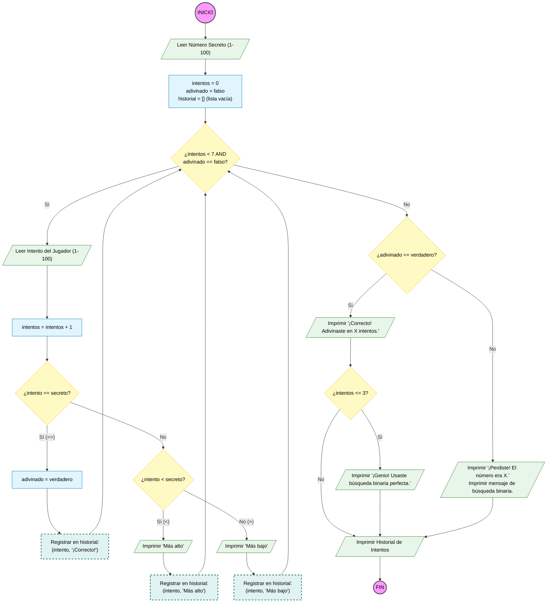

```mermaid
graph TD
    %% --- Estilos para claridad ---
    classDef inicioFin fill:#f9f,stroke:#333,stroke-width:2px,color:black;
    classDef proceso fill:#e1f5fe,stroke:#0277bd,stroke-width:1px,color:black;
    classDef decision fill:#fff9c4,stroke:#fbc02d,stroke-width:1px,color:black;
    classDef entradaSalida fill:#e8f5e9,stroke:#2e7d32,stroke-width:1px,color:black;
    classDef subproceso fill:#e0f2f1,stroke:#00695c,stroke-width:2px,stroke-dasharray: 5 5,color:black;

    %% --- 1. INICIO E INICIALIZACIÓN ---
    Start((INICIO)):::inicioFin --> ReadSecreto[/"Leer Número Secreto (1-100)"/]:::entradaSalida
    ReadSecreto --> InitVars["intentos = 0\nadivinado = falso\nhistorial = [] (lista vacía)"]:::proceso
    InitVars --> CycleStart{"¿intentos < 7 AND\nadivinado == falso?"}:::decision

    %% --- 2. CICLO DE JUEGO (Máx 7 intentos) ---
    CycleStart -- Sí --> ReadIntento[/"Leer Intento del Jugador (1-100)"/]:::entradaSalida
    ReadIntento --> IncrIntentos[intentos = intentos + 1]:::proceso
    IncrIntentos --> Compare{"¿intento == secreto?"}:::decision

    %% Caso 1: ¡Correcto!
    Compare -- Sí (==) --> SetAdivinado[adivinado = verdadero]:::proceso
    SetAdivinado --> RegCorrect["Registrar en historial:\n(intento, '¡Correcto!')"]:::subproceso
    RegCorrect --> CycleStart

    %% Caso 2: Más Bajo / Más Alto
    Compare -- No --> CompareHighLow{"¿intento < secreto?"}:::decision
    
    CompareHighLow -- Sí (<) --> PrintHigh[/"Imprimir 'Más alto'"/]:::entradaSalida
    PrintHigh --> RegHigh["Registrar en historial:\n(intento, 'Más alto')"]:::subproceso
    RegHigh --> CycleStart
    
    CompareHighLow -- No (>) --> PrintLow[/"Imprimir 'Más bajo'"/]:::entradaSalida
    PrintLow --> RegLow["Registrar en historial:\n(intento, 'Más bajo')"]:::subproceso
    RegLow --> CycleStart

    %% --- 3. SALIDA DEL CICLO Y RESULTADOS ---
    CycleStart -- No --> CheckWin{"¿adivinado == verdadero?"}:::decision

    %% Rama de Victoria
    CheckWin -- Sí --> PrintWin[/"Imprimir '¡Correcto! Adivinaste en X intentos.'"/]:::entradaSalida
    PrintWin --> CheckGenius{"¿intentos <= 3?"}:::decision
    CheckGenius -- Sí --> PrintGenius[/"Imprimir '¡Genio! Usaste búsqueda binaria perfecta.'"/]:::entradaSalida
    CheckGenius -- No --> PrintHistorial
    PrintGenius --> PrintHistorial

    %% Rama de Derrota
    CheckWin -- No --> PrintLose[/"Imprimir '¡Perdiste! El número era X.'\nImprimir mensaje de búsqueda binaria."/]:::entradaSalida
    PrintLose --> PrintHistorial

    %% --- 4. FINAL ---
    PrintHistorial[/"Imprimir Historial de Intentos"/]:::entradaSalida
    PrintHistorial --> End((FIN)):::inicioFin
```