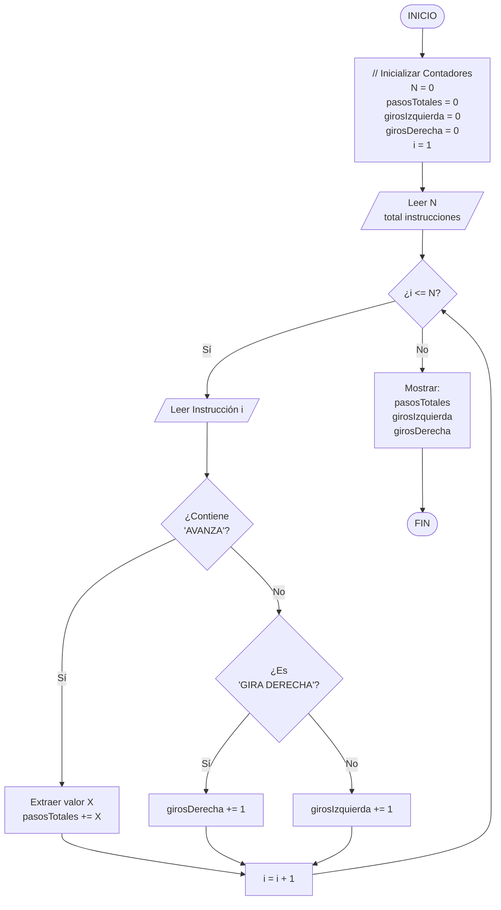

```mermaid
graph TD
    A([INICIO]) --> B["// Inicializar Contadores<br/>N = 0<br/>pasosTotales = 0<br/>girosIzquierda = 0<br/>girosDerecha = 0<br/>i = 1"]
    B --> C[/Leer N<br/>total instrucciones/]
    C --> D{¿i <= N?}
    
    D -- Sí --> E[/Leer Instrucción i/]
    
    E --> F{¿Contiene<br/>'AVANZA'?}
    
    F -- Sí --> G["Extraer valor X<br/>pasosTotales += X"]
    F -- No --> H{¿Es<br/>'GIRA DERECHA'?}
    
    H -- Sí --> I[girosDerecha += 1]
    H -- No --> J[girosIzquierda += 1]
    
    G --> K[i = i + 1]
    I --> K
    J --> K
    K --> D
    
    D -- No --> L["Mostrar:<br/>pasosTotales<br/>girosIzquierda<br/>girosDerecha"]
    L --> M([FIN])
```