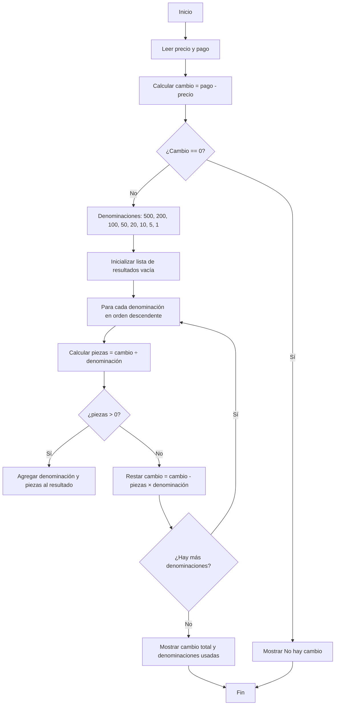

```mermaid
flowchart TD
    A[Inicio] --> B[Leer precio y pago]
    B --> C[Calcular cambio = pago - precio]
    C --> D{¿Cambio == 0?}
    D -- Sí --> E[Mostrar No hay cambio]
    D -- No --> F["Denominaciones: 500, 200, 100, 50, 20, 10, 5, 1"]
    F --> G[Inicializar lista de resultados vacía]
    G --> H[Para cada denominación en orden descendente]
    H --> I[Calcular piezas = cambio ÷ denominación]
    I --> J{¿piezas > 0?}
    J -- Sí --> K[Agregar denominación y piezas al resultado]
    J -- No --> L[Restar cambio = cambio - piezas × denominación]
    L --> M{¿Hay más denominaciones?}
    M -- Sí --> H
    M -- No --> N[Mostrar cambio total y denominaciones usadas]
    N --> O[Fin]
    E --> O
```
