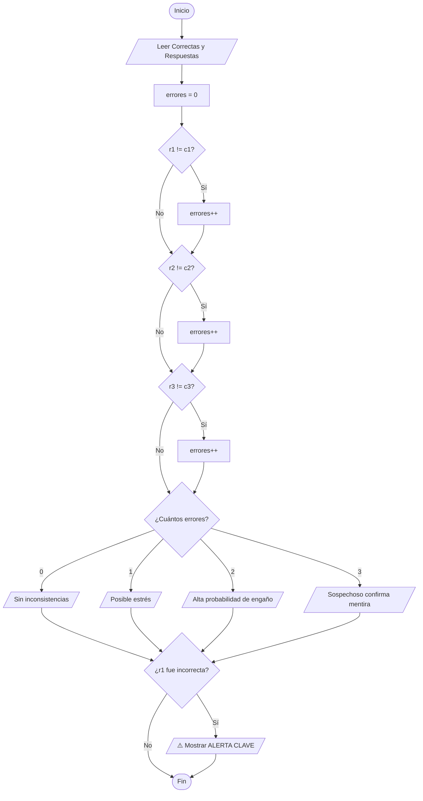

```mermaid
flowchart TD
%% Inicio y captura
Start([Inicio]) --> Input[/Leer Correctas y Respuestas/]
    Input --> Init[errores = 0]

    %% Conteo de fallos (Procesamiento)
    Init --> Check1{r1 != c1?}
    Check1 -- Sí --> Add1[errores++]
    Check1 -- No --> Check2{r2 != c2?}
    Add1 --> Check2
    
    Check2 -- Sí --> Add2[errores++]
    Check2 -- No --> Check3{r3 != c3?}
    Add2 --> Check3
    
    Check3 -- Sí --> Add3[errores++]
    Check3 -- No --> Result

    %% Clasificación del Veredicto
    Add3 --> Result{¿Cuántos errores?}
    
    Result -- 0 --> V0[/Sin inconsistencias/]
    Result -- 1 --> V1[/Posible estrés/]
    Result -- 2 --> V2[/Alta probabilidad de engaño/]
    Result -- 3 --> V3[/Sospechoso confirma mentira/]

    %% Verificación de Alerta (Independiente)
    V0 & V1 & V2 & V3 --> Alerta{¿r1 fue incorrecta?}
    
    Alerta -- Sí --> PrintWarn[/⚠️ Mostrar ALERTA CLAVE/]
    Alerta -- No --> End([Fin])
    PrintWarn --> End
```