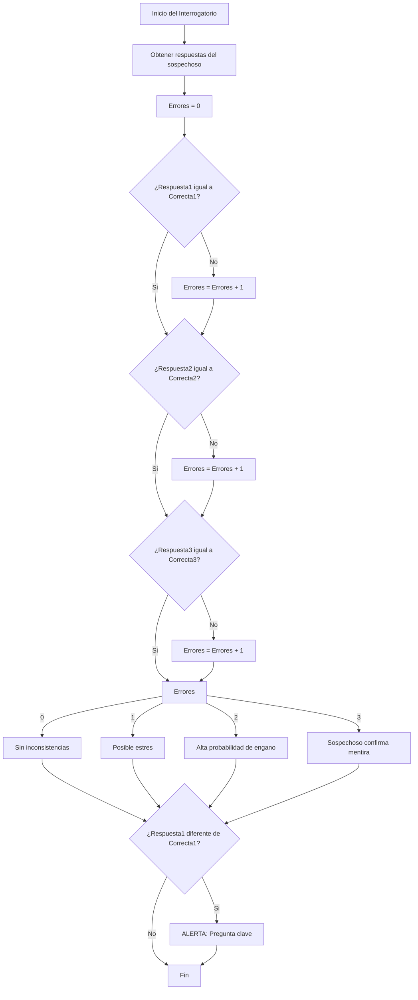

```mermaid
graph TD

Inicio[Inicio del Interrogatorio] --> Entrada[Obtener respuestas del sospechoso]
    Entrada --> Contador[Errores = 0]
    
%% --- ZONA DE CONTEO ---
    Contador --> Pregunta1{¿Respuesta1 igual a Correcta1?}
    
    Pregunta1 -- No --> Sumar1[Errores = Errores + 1]
    Pregunta1 -- Si --> Pregunta2{¿Respuesta2 igual a Correcta2?}
    Sumar1 --> Pregunta2

    Pregunta2 -- No --> Sumar2[Errores = Errores + 1]
    Pregunta2 -- Si --> Pregunta3{¿Respuesta3 igual a Correcta3?}
    Sumar2 --> Pregunta3
    
    Pregunta3 -- No --> Sumar3[Errores = Errores + 1]
    Pregunta3 -- Si --> Tabla
    Sumar3 --> Tabla
    
%% --- ZONA DE VEREDICTO (La Tabla de la verdad) ---
    Tabla[Errores]
    Tabla -- 0 --> R0[Sin inconsistencias]
    Tabla -- 1 --> R1[Posible estres]
    Tabla -- 2 --> R2[Alta probabilidad de engano]
    Tabla -- 3 --> R3[Sospechoso confirma mentira]

%% --- ZONA DE ALERTA FINAL ---
    R0 --> CheckClave
    R1 --> CheckClave
    R2 --> CheckClave
    R3 --> CheckClave
    CheckClave{¿Respuesta1 diferente de Correcta1?}
    CheckClave -- Si --> Alerta[ALERTA: Pregunta clave]
    CheckClave -- No --> Fin[Fin]
    Alerta --> Fin
```