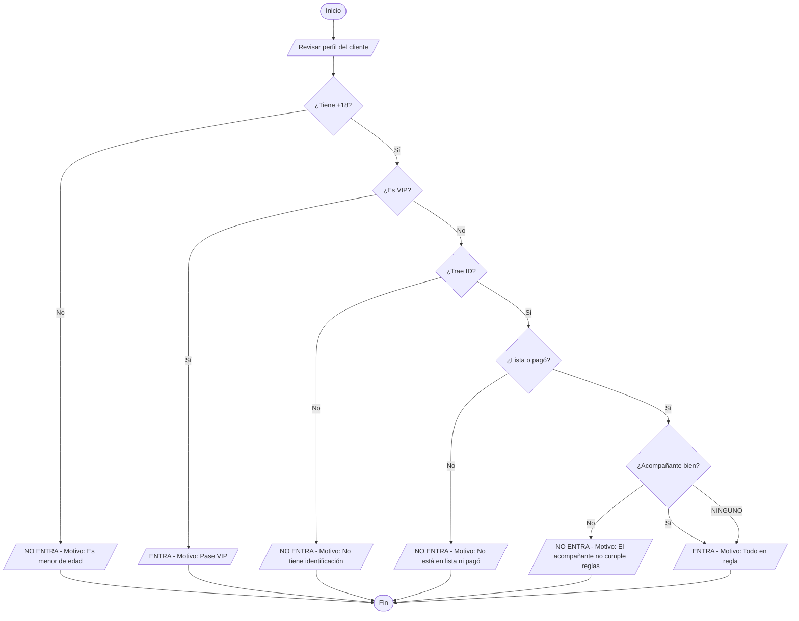

```mermaid
flowchart TD
%% Punto de partida
    Comienzo([Inicio]) --> Datos[/Revisar perfil del cliente/]
    
    %% La regla de oro (Edad)
    Datos --> EsMayor{¿Tiene +18?}
    EsMayor -- No --> FueraEdad[/NO ENTRA - Motivo: Es menor de edad/]
    
    %% El privilegio VIP
    EsMayor -- Sí --> SoyVIP{¿Es VIP?}
    SoyVIP -- Sí --> PaseVIP[/ENTRA - Motivo: Pase VIP/]
    
    %% Requisitos para mortales
    SoyVIP -- No --> TengoID{¿Trae ID?}
    TengoID -- No --> FueraID[/NO ENTRA - Motivo: No tiene identificación/]
    
    %% Filtro de dinero o invitación
    TengoID -- Sí --> InvitadoOPago{¿Lista o pagó?}
    InvitadoOPago -- No --> FueraPago[/NO ENTRA - Motivo: No está en lista ni pagó/]
    
    %% El filtro final (Acompañante)
    InvitadoOPago -- Sí --> AmigoOK{¿Acompañante bien?}
    AmigoOK -- No --> FueraAmigo[/NO ENTRA - Motivo: El acompañante no cumple reglas/]
    AmigoOK -- Sí --> PaseNormal[/ENTRA - Motivo: Todo en regla/]
    AmigoOK -- NINGUNO --> PaseNormal

    %% Cierre del algoritmo
    FueraEdad & PaseVIP & FueraID & FueraPago & FueraAmigo & PaseNormal --> Terminado([Fin])
```