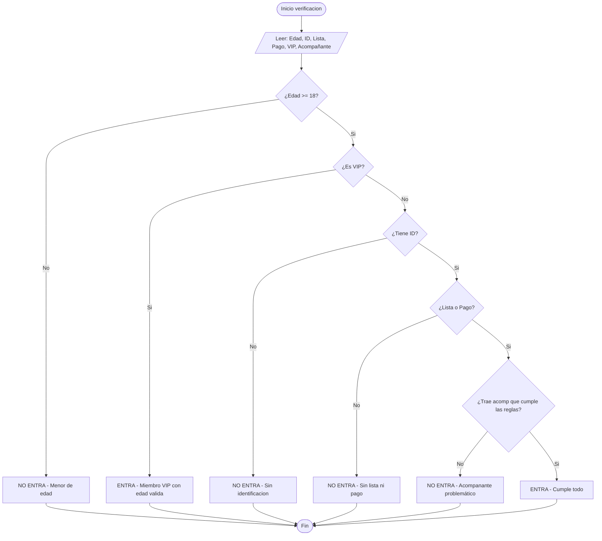

```mermaid
graph TD

    Inicio([Inicio verificacion]) --> Entradas[/Leer: Edad, ID, Lista, Pago, VIP, Acompañante/]
    Entradas --> CheckEdad{¿Edad >= 18?}

    %%-- Validacion de edad --
    CheckEdad -- No --> R_Edad[NO ENTRA - Menor de edad]

    %%-- Miembro VIP --
    CheckEdad -- Si --> CheckVIP{¿Es VIP?}
    CheckVIP -- Si --> R_VIP[ENTRA - Miembro VIP con edad valida]

    %%-- Identificación (Solo para NO VIP) --
    CheckVIP -- No --> CheckID{¿Tiene ID?}
    CheckID -- No --> R_ID[NO ENTRA - Sin identificacion]

    %%-- Validacion de lista o Pago --
    CheckID -- Si --> CheckAcceso{¿Lista o Pago?}
    CheckAcceso -- No --> R_Acceso[NO ENTRA - Sin lista ni pago]

    %%-- Acompañante --
    CheckAcceso -- Si --> CheckAcomp{¿Trae acomp que cumple las reglas?}
    CheckAcomp -- No --> R_Acomp[NO ENTRA - Acompanante problemático]
    CheckAcomp -- Si --> R_Exito[ENTRA - Cumple todo]

    %%-- Cierre --
    R_Edad --> Fin([Fin])
    R_VIP --> Fin
    R_ID --> Fin
    R_Acceso --> Fin
    R_Acomp --> Fin
    R_Exito --> Fin

```
    