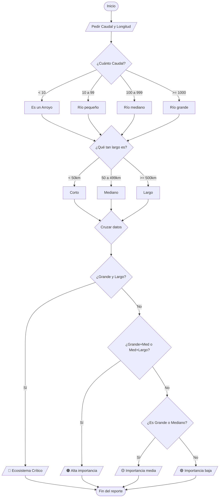

```mermaid
flowchart TD
%% Inicio y Captura
    Inicio([Inicio]) --> LeerDatos[/Pedir Caudal y Longitud/]

    %% Bloque 1: Clasificar Caudal
    LeerDatos --> RangoCaudal{¿Cuánto Caudal?}
    RangoCaudal -- "< 10" --> C1[Es un Arroyo]
    RangoCaudal -- "10 a 99" --> C2[Río pequeño]
    RangoCaudal -- "100 a 999" --> C3[Río mediano]
    RangoCaudal -- ">= 1000" --> C4[Río grande]

    %% Bloque 2: Clasificar Longitud
    C1 & C2 & C3 & C4 --> RangoLong{¿Qué tan largo es?}
    RangoLong -- "< 50km" --> L1[Corto]
    RangoLong -- "50 a 499km" --> L2[Mediano]
    RangoLong -- ">= 500km" --> L3[Largo]

    %% Bloque 3: Cruce Ecológico (Lógica de importancia)
    L1 & L2 & L3 --> Analisis{Cruzar datos}
    
    Analisis --> Case1{¿Grande y Largo?}
    Case1 -- Sí --> Rojo[/🔴 Ecosistema Crítico/]
    
    Case1 -- No --> Case2{¿Grande+Med o Med+Largo?}
    Case2 -- Sí --> Naranja[/🟠 Alta importancia/]
    
    Case2 -- No --> Case3{¿Es Grande o Mediano?}
    Case3 -- Sí --> Amarillo[/🟡 Importancia media/]
    Case3 -- No --> Verde[/🟢 Importancia baja/]

    %% Cierre
    Rojo & Naranja & Amarillo & Verde --> Fin([Fin del reporte])
```