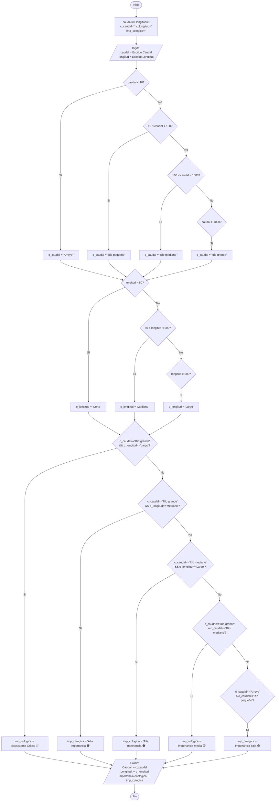

```mermaid
flowchart TD
    A([Inicio])

    A --> B[caudal=0, longitud=0\nc_caudal='', c_longitud=''\nimp_cologica='']

    B --> C[/Digita:\ncaudal = Escribe Caudal\nlongitud = Escribe Longitud/]

    C --> D{caudal < 10?}

    D -- Sí --> D1[c_caudal = 'Arroyo']
    D -- No --> E{10 ≤ caudal < 100?}

    E -- Sí --> E1[c_caudal = 'Río pequeño']
    E -- No --> F{100 ≤ caudal < 1000?}

    F -- Sí --> F1[c_caudal = 'Río mediano']
    F -- No --> G{caudal ≥ 1000?}

    G -- Sí --> G1[c_caudal = 'Río grande']

    D1 & E1 & F1 & G1 --> H{longitud < 50?}

    H -- Sí --> H1[c_longitud = 'Corto']
    H -- No --> I{50 ≤ longitud < 500?}

    I -- Sí --> I1[c_longitud = 'Mediano']
    I -- No --> J{longitud ≥ 500?}

    J -- Sí --> J1[c_longitud = 'Largo']

    H1 & I1 & J1 --> K{c_caudal=='Río grande'\n&& c_longitud=='Largo'?}

    K -- Sí --> K1[imp_cologica = 'Ecosistema Crítico 🔴']
    K -- No --> L{c_caudal=='Río grande'\n&& c_longitud=='Mediano'?}

    L -- Sí --> L1[imp_cologica = 'Alta importancia 🟠']
    L -- No --> M{c_caudal=='Río mediano'\n&& c_longitud=='Largo'?}

    M -- Sí --> M1[imp_cologica = 'Alta importancia 🟠']
    M -- No --> N{c_caudal=='Río grande'\no c_caudal=='Río mediano'?}

    N -- Sí --> N1[imp_cologica = 'Importancia media 🟡']
    N -- No --> O{c_caudal=='Arroyo'\no c_caudal=='Río pequeño'?}

    O -- Sí --> O1[imp_cologica = 'Importancia baja 🟢']

    K1 & L1 & M1 & N1 & O1 --> P[/Salida:\nCaudal: + c_caudal\nLongitud: + c_longitud\nImportancia ecológica: + imp_cologica/]

    P --> Q([Fin])
```