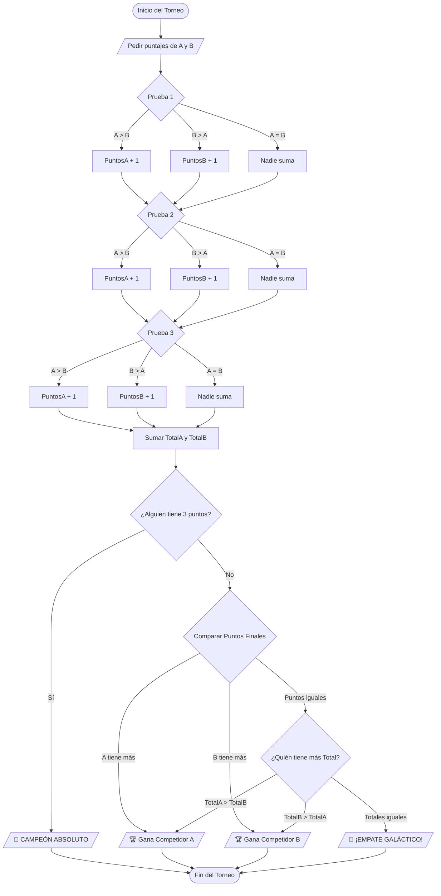

```mermaid
flowchart TD
%% Inicio y Captura
    Inicio([Inicio del Torneo]) --> Datos[/Pedir puntajes de A y B/]
    
    %% Bloque 1: Las 3 Batallas
    Datos --> P1{Prueba 1}
    P1 -- "A > B" --> WinA1[PuntosA + 1]
    P1 -- "B > A" --> WinB1[PuntosB + 1]
    P1 -- "A = B" --> Empate1[Nadie suma]

    WinA1 & WinB1 & Empate1 --> P2{Prueba 2}
    P2 -- "A > B" --> WinA2[PuntosA + 1]
    P2 -- "B > A" --> WinB2[PuntosB + 1]
    P2 -- "A = B" --> Empate2[Nadie suma]

    WinA2 & WinB2 & Empate2 --> P3{Prueba 3}
    P3 -- "A > B" --> WinA3[PuntosA + 1]
    P3 -- "B > A" --> WinB3[PuntosB + 1]
    P3 -- "A = B" --> Empate3[Nadie suma]

    %% Bloque 2: Totales para desempate
    WinA3 & WinB3 & Empate3 --> Totales[Sumar TotalA y TotalB]

    %% Bloque 3: ¿Hay Campeón Absoluto?
    Totales --> Absoluto{¿Alguien tiene 3 puntos?}
    Absoluto -- Sí --> Gold[/🥇 CAMPEÓN ABSOLUTO /]
    Absoluto -- No --> Veredicto{Comparar Puntos Finales}

    %% Bloque 4: Quién gana o desempate
    Veredicto -- "A tiene más" --> GanadorA[/🏆 Gana Competidor A/]
    Veredicto -- "B tiene más" --> GanadorB[/🏆 Gana Competidor B/]
    
    Veredicto -- "Puntos iguales" --> Desempate{¿Quién tiene más Total?}
    Desempate -- "TotalA > TotalB" --> GanadorA
    Desempate -- "TotalB > TotalA" --> GanadorB
    Desempate -- "Totales iguales" --> Galaxy[/🌌 ¡EMPATE GALÁCTICO! /]

    %% Cierre
    Gold & GanadorA & GanadorB & Galaxy --> Fin([Fin del Torneo])
```