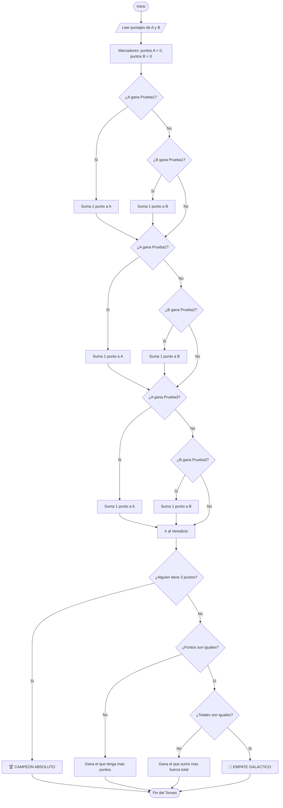

```mermaid
graph TD

    Inicio([Inicio]) --> Leer[/Leer puntajes de A y B/]
    Leer --> Init[Marcadores: puntos A = 0, puntos B = 0]

    %% --- PRUEBA 1 ---
    Init --> Prueba1{¿A gana Prueba1?}
    Prueba1 -- Si --> GanaA1[Suma 1 punto a A]
    Prueba1 -- No --> Prueba1b{¿B gana Prueba1?}
    Prueba1b -- Si --> GanaB1[Suma 1 punto a B]
    Prueba1b -- No --> Prueba2[Siguiente Prueba]
    GanaA1 & GanaB1 --> Prueba2

    %% --- PRUEBA 2 ---
    Prueba2{¿A gana Prueba2?}
    Prueba2 -- Si --> GanaA2[Suma 1 punto a A]
    Prueba2 -- No --> Prueba2b{¿B gana Prueba2?}
    Prueba2b -- Si --> GanaB2[Suma 1 punto a B]
    Prueba2b -- No --> Prueba3[Siguiente Prueba]
    GanaA2 & GanaB2 --> Prueba3

    %% --- PRUEBA 3 ---
    Prueba3{¿A gana Prueba3?}
    Prueba3 -- Si --> GanaA3[Suma 1 punto a A]
    Prueba3 -- No --> Prueba3b{¿B gana Prueba3?}
    Prueba3b -- Si --> GanaB3[Suma 1 punto a B]
    Prueba3b -- No --> Resultado[Ir al Veredicto]
    GanaA3 & GanaB3 --> Resultado

    %% --- VEREDICTO FINAL ---
    Resultado --> Campeon{¿Alguien tiene 3 puntos?}
    Campeon -- Si --> Absoluto[🏆 CAMPEON ABSOLUTO]
    
    Campeon -- No --> ComparacionPuntos{¿Puntos son iguales?}
    
    ComparacionPuntos -- No --> GanaPuntos[Gana el que tenga mas puntos]
    
    %% --- EL DESEMPATE ---
    ComparacionPuntos -- Si --> ComparacionTotal{¿Totales son iguales?}
    ComparacionTotal -- No --> GanaTotal[Gana el que sumo mas fuerza total]
    ComparacionTotal -- Si --> Galactico[🌌 EMPATE GALACTICO]

    Absoluto & GanaPuntos & GanaTotal & Galactico --> Fin([Fin del Torneo])
```
