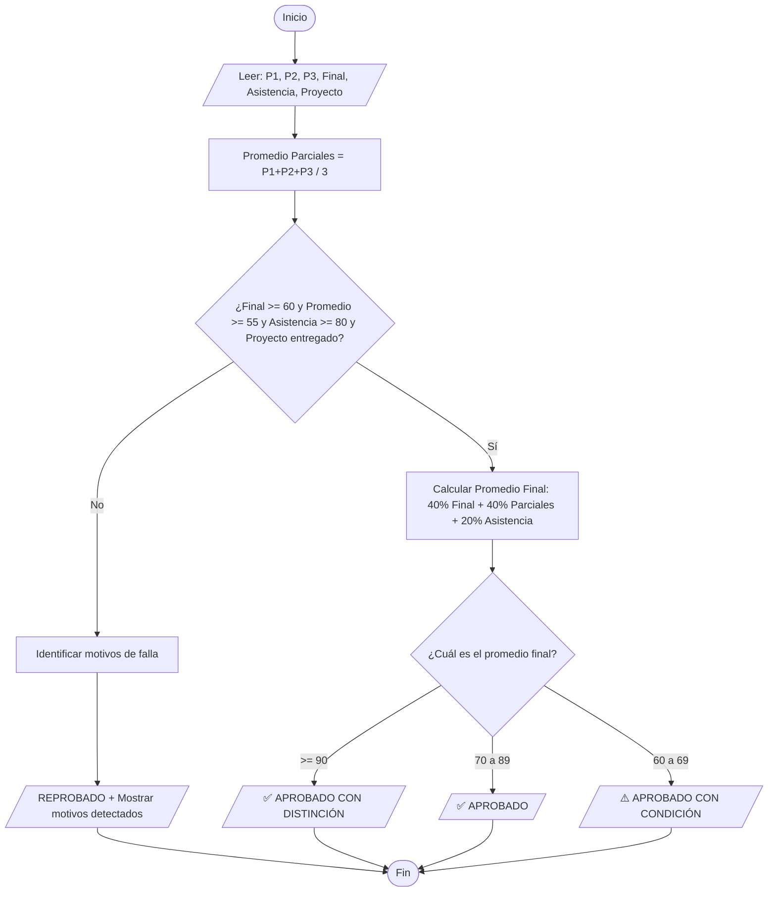

```mermaid
flowchart TD
%% Inicio y preparación
    Start([Inicio]) --> Leer[/Leer: P1, P2, P3, Final, Asistencia, Proyecto/]
    Leer --> CalcProm[Promedio Parciales = P1+P2+P3 / 3]
    
    %% La Gran Auditoría (Revisión de Requisitos)
    CalcProm --> Check1{¿Final >= 60 y Promedio >= 55 y Asistencia >= 80 y Proyecto entregado?}
    
    %% Camino del Reprobado
    Check1 -- No --> Motivos[Identificar motivos de falla]
    Motivos --> Fail[/REPROBADO + Mostrar motivos detectados/]
    
    %% Camino del Aprobado
    Check1 -- Sí --> Calificar[Calcular Promedio Final: 40% Final + 40% Parciales + 20% Asistencia]
    
    Calificar --> Rango{¿Cuál es el promedio final?}
    
    Rango -- ">= 90" --> Distincion[/✅ APROBADO CON DISTINCIÓN/]
    Rango -- "70 a 89" --> Normal[/✅ APROBADO/]
    Rango -- "60 a 69" --> Condicion[/⚠️ APROBADO CON CONDICIÓN/]
    
    %% Cierre
    Fail & Distincion & Normal & Condicion --> End([Fin])
```

