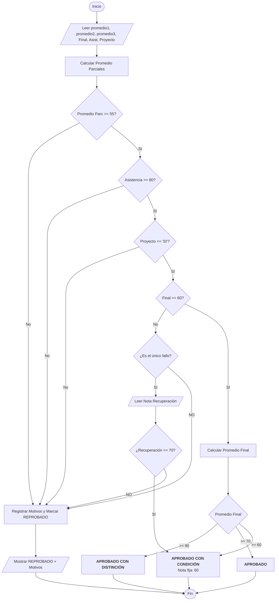

```mermaid
graph TD

    Start([Inicio]) --> Input[/Leer promedio1, promedio2, promedio3, Final, Asist, Proyecto/]
    Input --> CalcParcial[Calcular Promedio Parciales]
    
    %% Verificación de condiciones en secuencia
    CalcParcial --> CondicionParcial{Promedio Parc >= 55?}
    CondicionParcial -- No --> Fallo[Registrar Motivos y Marcar REPROBADO]
    
    CondicionParcial -- SI --> CondicionAsis{Asistencia >= 80?}
    CondicionAsis -- No --> Fallo
    
    CondicionAsis -- SI --> CondicionProyecto{Proyecto == 'SI'?}
    CondicionProyecto -- No --> Fallo
    
    CondicionProyecto -- SI --> CondicionFinal{Final >= 60?}
    
    %% Lógica Especial: Recuperación
    CondicionFinal -- No --> verificacionExtra{¿Es el único fallo?}
    verificacionExtra -- SI --> Recuperacion[/Leer Nota Recuperación/]
    Recuperacion --> verificacionRecuperacion{¿Recuperación >= 70?}
    verificacionRecuperacion -- SI --> Rallando[<b>APROBADO CON CONDICIÓN</b><br/>Nota fija: 60]
    verificacionRecuperacion -- NO --> Fallo
    verificacionExtra -- NO --> Fallo

    %% Lógica de Aprobación Normal
    CondicionFinal -- SI --> CalcFinal[Calcular Promedio Final]
    
    %% Clasificación
    CalcFinal --> Rango{Promedio Final}
    Rango -- ">= 90" --> Distincion[<b>APROBADO CON DISTINCIÓN</b>]
    Rango -- ">= 70" --> Aprobado[<b>APROBADO</b>]
    Rango -- ">= 60" --> Rallando
    
    %% Salidas Finales
    Fallo --> Reprobado[/Mostrar REPROBADO + Motivos/]
    Distincion --> End([Fin])
    Aprobado --> End
    Rallando --> End
    Reprobado --> End


```