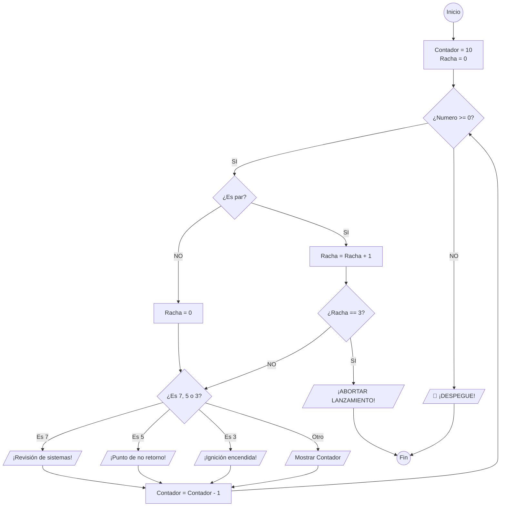

```mermaid
flowchart TD
    Inicio((Inicio)) --> Preparar[Contador = 10 <br/> Racha = 0]
    
    Preparar --> RevisarNumero{¿Numero >= 0?}
    
    RevisarNumero -- SI --> EsPar{¿Es par?}
    
    EsPar -- SI --> AumentarRacha[Racha = Racha + 1]
    EsPar -- NO --> ReiniciarRacha[Racha = 0]
    
    AumentarRacha --> pruebaAborto{¿Racha == 3?}
    ReiniciarRacha --> MirarMensajes
    
    pruebaAborto -- SI --> Abortar[/¡ABORTAR LANZAMIENTO!/]
    pruebaAborto -- NO --> MirarMensajes{¿Es 7, 5 o 3?}
    
    MirarMensajes -- Es 7 --> Msj7[/¡Revisión de sistemas!/]
    MirarMensajes -- Es 5 --> Msj5[/¡Punto de no retorno!/]
    MirarMensajes -- Es 3 --> Msj3[/¡Ignición encendida!/]
    MirarMensajes -- Otro --> SoloNumero[/Mostrar Contador/]
    
    Msj7 --> BajarCuenta[Contador = Contador - 1]
    Msj5 --> BajarCuenta
    Msj3 --> BajarCuenta
    SoloNumero --> BajarCuenta
    
    BajarCuenta --> RevisarNumero
    
    RevisarNumero -- NO --> Despegue[/🚀 ¡DESPEGUE!/]
    
    Abortar --> Fin((Fin))
    Despegue --> Fin
```