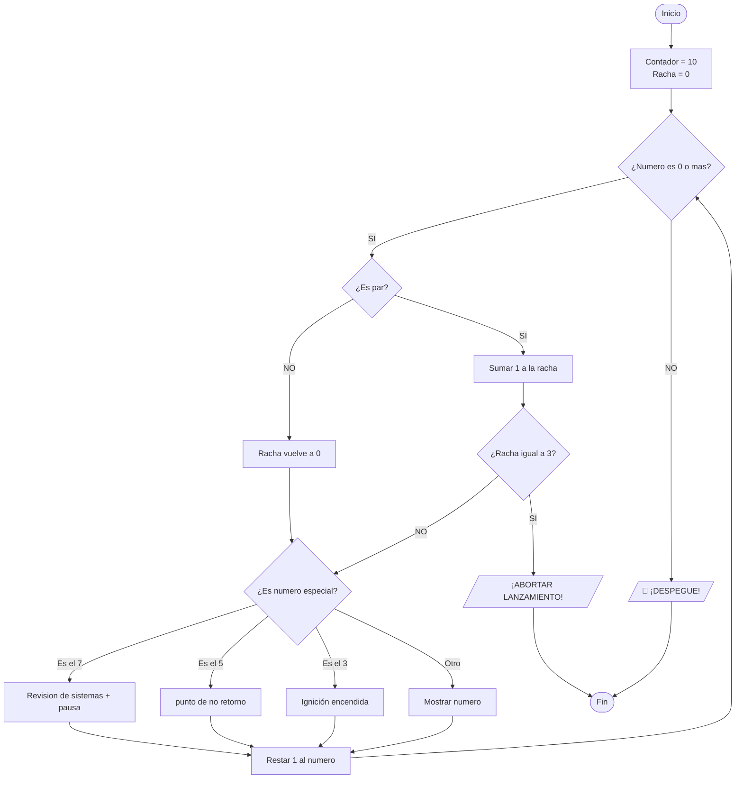

```mermaid
flowchart TD
    Inicio([Inicio]) --> Preparar[Contador = 10 <br/> Racha = 0]
    Preparar --> RevisarNumero{¿Numero es 0 o mas?}
    
    RevisarNumero -- SI --> EsPar{¿Es par?}
    
    EsPar -- SI --> AumentarRacha[Sumar 1 a la racha]
    EsPar -- NO --> ReiniciarRacha[Racha vuelve a 0]
    
    AumentarRacha --> pruebaAborto{¿Racha igual a 3?}
    ReiniciarRacha --> MirarMensajes
    
    pruebaAborto -- SI --> Abortar[/¡ABORTAR LANZAMIENTO!/]
    pruebaAborto -- NO --> MirarMensajes{¿Es numero especial?}
    
    MirarMensajes -- Es el 7 --> Msj7[Revision de sistemas + pausa]
    MirarMensajes -- Es el 5 --> Msj5[punto de no retorno]
    MirarMensajes -- Es el 3 --> Msj3[Ignición encendida]
    MirarMensajes -- Otro --> SoloNumero[Mostrar numero]
    
    Msj7 --> BajarCuenta[Restar 1 al numero]
    Msj5 --> BajarCuenta
    Msj3 --> BajarCuenta
    SoloNumero --> BajarCuenta
    
    BajarCuenta --> RevisarNumero
    
    RevisarNumero -- NO --> Despegue[/🚀 ¡DESPEGUE!/]
    
    Abortar --> Fin([Fin])
    Despegue --> Fin
```