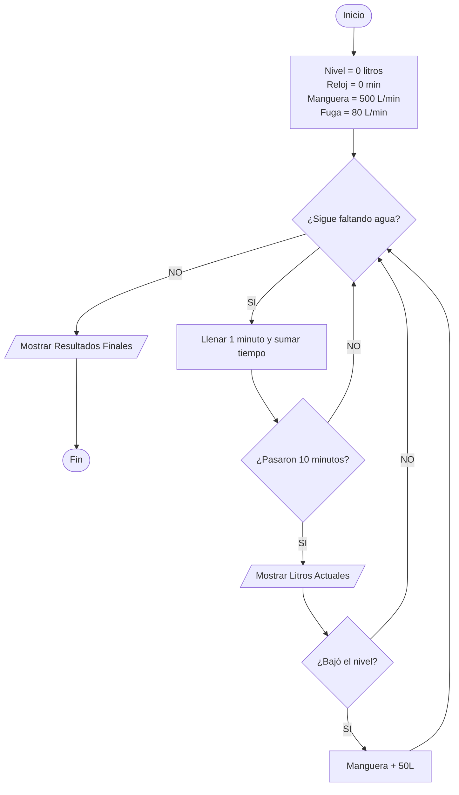

```mermaid
flowchart TD
    Inicio([Inicio]) --> Preparar[Nivel = 0 litros <br/> Reloj = 0 min <br/> Manguera = 500 L/min <br/> Fuga = 80 L/min]
    
    Preparar --> Ciclo{¿Sigue faltando agua?}
    
    %% EL "NO" QUE APAGA TODO
    Ciclo -- NO --> Resumen[/Mostrar Resultados Finales/]
    Resumen --> Fin([Fin])
    
    %% EL "SI" QUE ENTRA A TRABAJAR
    Ciclo -- SI --> Accion[Llenar 1 minuto y sumar tiempo]
    
    Accion --> Revision{¿Pasaron 10 minutos?}
    
    %% EL "NO" DE SEGUIR IGUAL
    Revision -- NO --> Ciclo
    
    %% EL "SI" DE REVISAR
    Revision -- SI --> Nivel[/Mostrar Litros Actuales/]
    Nivel --> Heliodoro{¿Bajó el nivel?}
    
    Heliodoro -- SI --> Subir[Manguera + 50L]
    Subir --> Ciclo
    
    %% EL OTRO "NO" DE SEGUIR IGUAL
    Heliodoro -- NO --> Ciclo
```