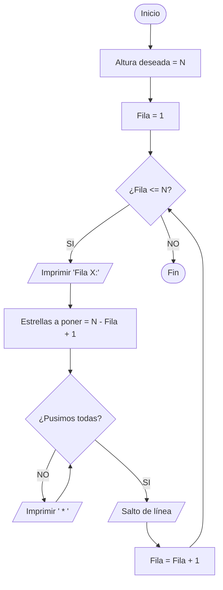

```mermaid
flowchart TD
    Inicio([Inicio]) --> Ingreso[Altura deseada = N]
    Ingreso --> Fila1[Fila = 1]
    
    Fila1 --> CheckFila{¿Fila <= N?}
    
    CheckFila -- SI --> Texto[/Imprimir 'Fila X:'/]
    Texto --> Col1[Estrellas a poner = N - Fila + 1]
    
    Col1 --> CicloEstrellas{¿Pusimos todas?}
    
    CicloEstrellas -- NO --> Poner[/Imprimir ' * '/]
    Poner --> CicloEstrellas
    
    CicloEstrellas -- SI --> Salto[/Salto de línea/]
    Salto --> SigFila[Fila = Fila + 1]
    SigFila --> CheckFila
    
    CheckFila -- NO --> Fin([Fin])
```