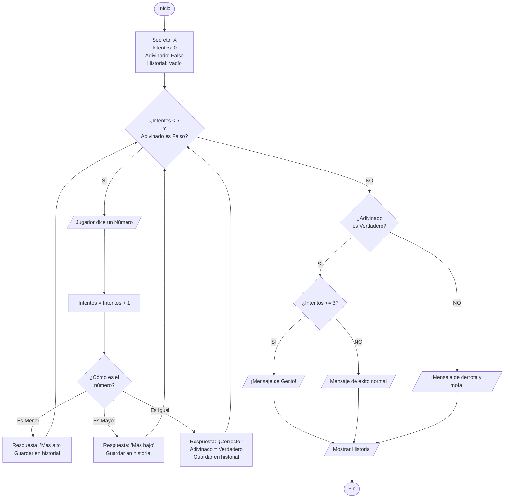

```mermaid
flowchart TD
    Inicio([Inicio]) --> Prep[Secreto: X <br/> Intentos: 0 <br/> Adivinado: Falso <br/> Historial: Vacío]
    
    Prep --> Ciclo{¿Intentos < 7 <br/> Y <br/> Adivinado es Falso?}
    
    %% CAMINO DEL JUEGO (DENTRO DEL CICLO)
    Ciclo -- SI --> Entrada[/Jugador dice un Número/]
    Entrada --> Mas1[Intentos = Intentos + 1]
    
    Mas1 --> Comparar{¿Cómo es el <br/> número?}
    
    Comparar -- "Es Menor" --> Menor[Respuesta: 'Más alto' <br/> Guardar en historial]
    Comparar -- "Es Mayor" --> Mayor[Respuesta: 'Más bajo' <br/> Guardar en historial]
    Comparar -- "Es Igual" --> Ganaste[Respuesta: '¡Correcto!' <br/> Adivinado = Verdadero <br/> Guardar en historial]
    
    Menor --> Ciclo
    Mayor --> Ciclo
    Ganaste --> Ciclo
    
    %% CAMINO DE SALIDA (FUERA DEL CICLO)
    Ciclo -- NO --> Resultado{¿Adivinado <br/> es Verdadero?}
    
    Resultado -- SI --> Bonus{¿Intentos <= 3?}
    Bonus -- SI --> Genio[/¡Mensaje de Genio!/]
    Bonus -- NO --> Normal[/Mensaje de éxito normal/]
    
    Resultado -- NO --> Perdiste[/¡Mensaje de derrota y mofa!/]
    
    Genio --> MostrarHistorial[/Mostrar Historial/]
    Normal --> MostrarHistorial
    Perdiste --> MostrarHistorial
    
    MostrarHistorial --> Fin([Fin])
```