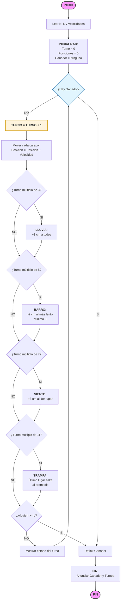

```mermaid
graph TD
    %% Inicio del proceso
    Inicio([<b>INICIO</b>]) --> LeerDatos[Leer N, L y Velocidades]
    LeerDatos --> Inicializar[<b>INICIALIZAR:</b><br/>Turno = 0<br/>Posiciones = 0<br/>Ganador = Ninguno]
    
    %% Ciclo Principal
    Inicializar --> Loop{¿Hay Ganador?}
    
    Loop -- NO --> IncTurno[<b>TURNO = TURNO + 1</b>]
    
    %% Movimiento Base
    IncTurno --> MoverBase[Mover cada caracol:<br/>Posición = Posición + Velocidad]
    
    %% Sección de Eventos
    MoverBase --> Evento3{¿Turno múltiplo de 3?}
    Evento3 -- SI --> Lluvia[<b>LLUVIA:</b><br/>+1 cm a todos]
    Evento3 -- NO --> Evento5{¿Turno múltiplo de 5?}
    
    Lluvia --> Evento5
    
    Evento5 -- SI --> Barro[<b>BARRO:</b><br/>-2 cm al más lento<br/>Mínimo 0]
    Evento5 -- NO --> Evento7{¿Turno múltiplo de 7?}
    
    Barro --> Evento7
    
    Evento7 -- SI --> Viento[<b>VIENTO:</b><br/>+3 cm al 1er lugar]
    Evento7 -- NO --> Evento11{¿Turno múltiplo de 11?}
    
    Viento --> Evento11
    
    Evento11 -- SI --> Trampa[<b>TRAMPA:</b><br/>Último lugar salta<br/>al promedio]
    Evento11 -- NO --> VerifMeta
    
    Trampa --> VerifMeta
    
    %% Verificación de Meta
    VerifMeta{¿Alguien >= L?}
    VerifMeta -- NO --> MostrarEstado[Mostrar estado del turno]
    MostrarEstado --> Loop
    
    VerifMeta -- SI --> SetGanador[Definir Ganador]
    
    %% Finalización
    SetGanador --> FinCarrera[<b>FIN:</b><br/>Anunciar Ganador y Turnos]
    Loop -- SI --> SetGanador
    FinCarrera --> Fin([<b>FIN</b>])

    %% Estilos
    style Inicio fill:#f9f,stroke:#333,stroke-width:2px
    style Fin fill:#f9f,stroke:#333,stroke-width:2px
    style IncTurno fill:#fff4dd,stroke:#d4a017,stroke-width:2px
    style Loop fill:#e1f5fe,stroke:#01579b
```